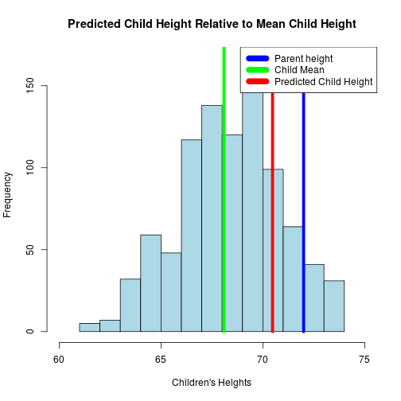

## Regression to the Mean

### Key Principal

- Things tend to even out over time
- If you have an extreme measurement, your next measurement is likely to be less extreme

---

## Galton Data

Summary: Galton data shows that children's heights tend to regress to the mean

- Tall parents have tall children
- Short parents have short children
- Very tall parents have children shorter than themselves
- Very short parents have children taller than themselves

---

## Illustration via Linear Regression

---

## Try it Out!

Test predictions based on a linear model of the Galton data using my ShinyApp:

- [Galton Child Height Regression](https://canuteson.shinyapps.io/galton_regression/)

